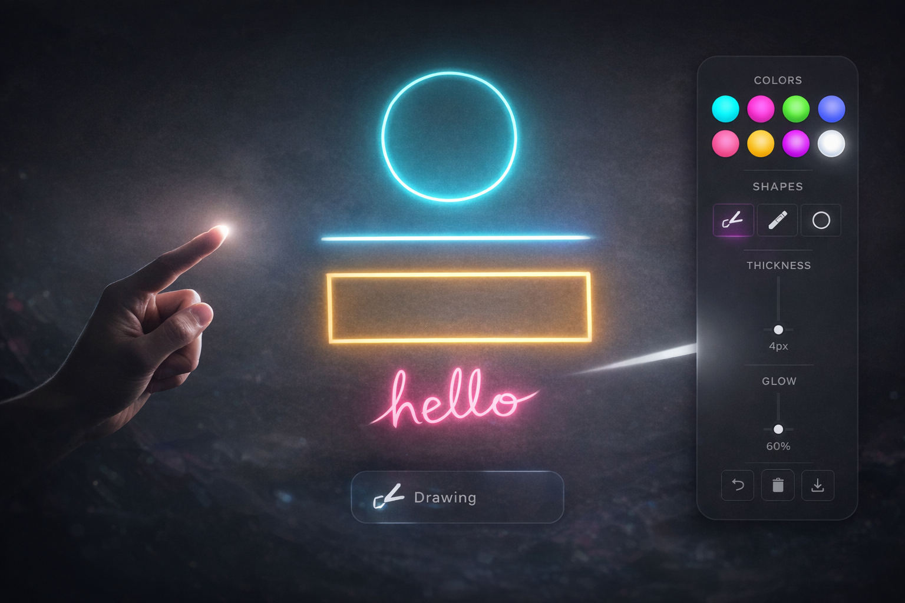

<h1 align="center">✨ AirDraw AI ✨</h1>

<p align="center">
  <b>🖐️ Draw in the air using hand gestures powered by AI & Computer Vision</b>
</p>

<p align="center">
  🚀 Gesture-Based Drawing &nbsp; | &nbsp; 🧠 AI Shape Correction &nbsp; | &nbsp; 🎨 Futuristic UI
</p>

---

<p align="center">
  <a href="https://air-draw-one.vercel.app/">
    
  </a>
</p>

---

## 🎥 Preview

<p align="center">
  
</p>

---

## 🌟 About The Project

<p align="center">
AirDraw AI is an innovative gesture-based drawing application that allows users to create digital art in mid-air using hand movements.  
It leverages <b>AI-powered hand tracking</b> and <b>real-time rendering</b> to transform natural gestures into precise digital drawings.  
</p>

<p align="center">
This project combines <b>computer vision</b>, <b>AI-assisted drawing</b>, and a <b>modern glass UI</b> to deliver a futuristic creative experience.
</p>

---

## ⚡ Features

<p align="center">

🖐️ <b>Gesture Drawing</b>
☝️ Draw using index finger   |   ✋ Erase with open palm   |   🤏 Move objects

<br><br>

🧠 <b>AI Smart Drawing</b>
🔵 Perfect circles   |   📏 Straight lines   |   🟨 Clean rectangles
✍️ Smooth letters & numbers

<br><br>

🎨 <b>Creative Tools</b>
🎨 Color palette   |   📏 Thickness control   |   ✨ Glow effects
🧩 Manual shape tools

<br><br>

💾 <b>Export System</b>
📸 Save as PNG   |   🔄 Undo & Clear

<br><br>

📱 <b>Responsive UI</b>
Works across all devices with smooth animations

</p>

---

## 🧠 Tech Stack

<p align="center">

| 🚀 Technology  | 💡 Purpose     |
| -------------- | -------------- |
| JavaScript     | Core Logic     |
| MediaPipe      | Hand Tracking  |
| HTML5 Canvas   | Drawing Engine |
| CSS (Glass UI) | Modern Design  |

</p>

---

## 🎮 Gesture Controls

<p align="center">

| Gesture         | Action |
| --------------- | ------ |
| ☝️ Index Finger | Draw   |
| ✋ Open Palm     | Erase  |
| 🤏 Pinch        | Move   |
| ✊ Fist          | Idle   |

</p>

---

## 🧩 Project Structure

<p align="center">

```
📁 AirDraw AI
 ├── index.html
 ├── assets/
 │   ├── style.css
 │   ├── style.js
 │   └── logo.png
```

</p>

---

## 🚀 Installation

<p align="center">

```bash
git clone https://github.com/yourusername/airdraw-ai.git
cd airdraw-ai
```

Open in browser:

```bash
index.html
```

</p>

---

## 💡 Future Enhancements

<p align="center">

🎤 Voice Control
🎥 Drawing Replay System
🌐 Multiplayer Collaboration
🧠 AI Text Recognition

</p>

---

## 👨‍💻 Author

<p align="center">

<b>Mohamed Rizwan</b>
AI & Data Science Student 🚀
Passionate about building intelligent systems

</p>

---

## ⭐ Support

<p align="center">

If you like this project
⭐ Star the repository
🚀 Share with others
💡 Follow for more projects

</p>

---

<p align="center">
🔥 Built with Passion • Innovation • AI 🔥
</p>
